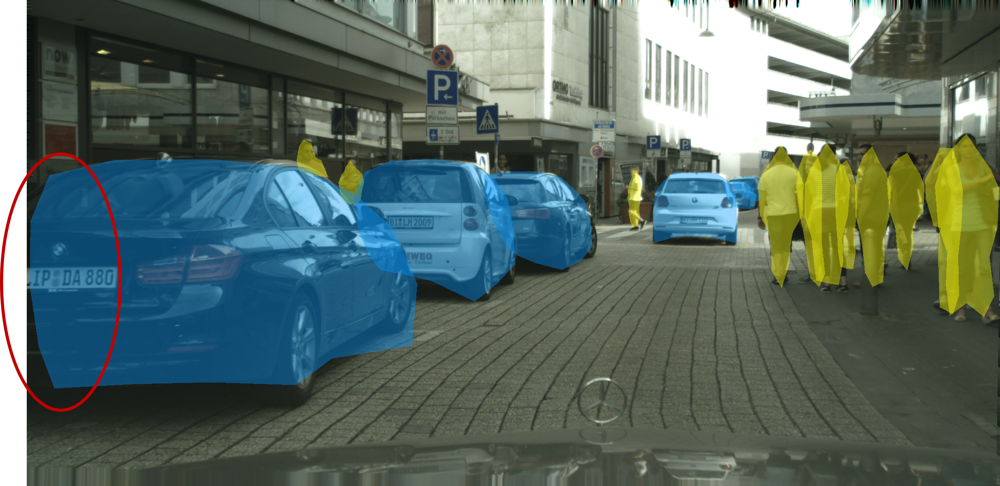
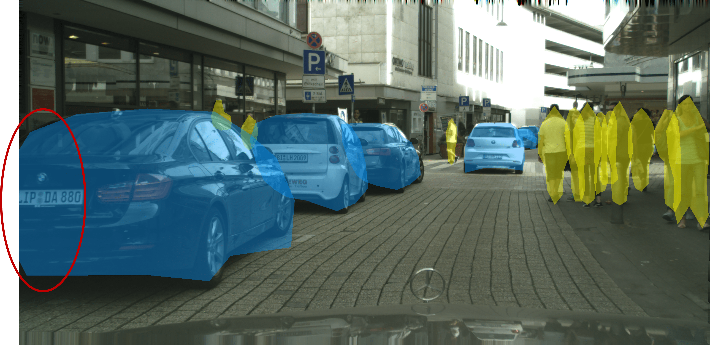
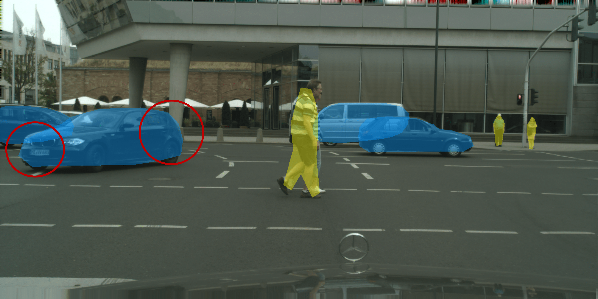
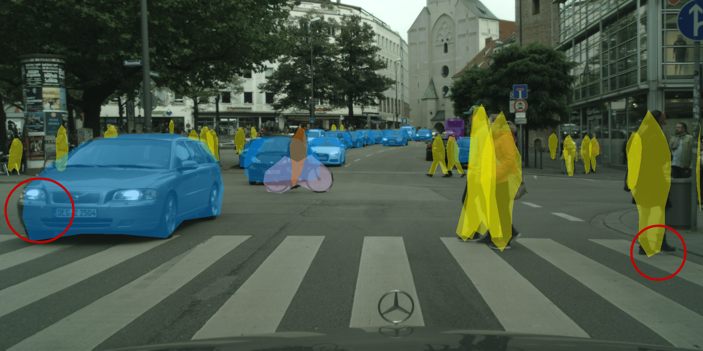
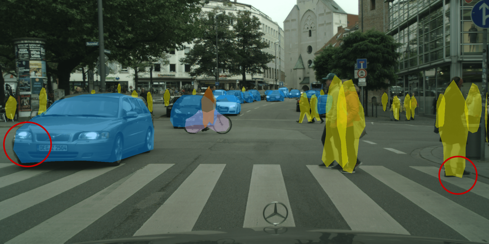

# CenterPoly v2
Repository for the paper Real-time Instance Segmentation with polygons using an Intersection-over-Union loss (CenterPoly v2)
  by Katia Jodogne-del Litto1, Guillaume-Alexandre Bilodeau1.
 
1 Polytechnique Montréal

## Abstract
Predicting a binary mask for an object is more accurate but also more computationally expensive than a bounding box. Polygonal masks as developed in CenterPoly can be a good compromise. In this paper, we improve over CenterPoly by enhancing the classical regression L1 loss with a novel region-based loss and a novel order loss, as well as with a new training process for the vertices prediction head. Moreover, the previous methods that predict polygonal masks use different coordinate systems, but it is not clear if one is better than another, if we abstract the architecture requirement. We therefore investigate their impact on the prediction. We also use a new evaluation protocol with oracle predictions for the detection head, to further isolate the segmentation process and better compare the polygonal masks with binary masks.  Our instance segmentation method is trained and tested with challenging datasets containing urban scenes, with a high density of road users. Experiments show, in particular, that using a combination of a regression loss and a region-based loss allows significant improvements on the Cityscapes and IDD test set compared to CenterPoly. Moreover the inference stage remains fast enough to reach real-time performance with an average of 0.045 s per frame for 2048x1024 images on a single RTX 2070 GPU.

Our contributions:
- We present a novel Intersection-over-Union loss function for polygons with Weiler-Atherton algorithm;
- We introduce a new loss based on the vertex order;
- We study the impact of the geometric representation of polygon vertices for mask approximation, by comparing the Cartesian and polar representations;
- We propose a new evaluation experiments to assess more precisely the quality of the generated polygon masks by decoupling detection from the mask construction. It shows that our method improves significantly over CenterPoly.

## Example results:  Comparison with CenterPoly
CenterPoly      |  CenterPoly v2
:-------------------------:|:-------------------------:
  |  
  |  
  |  

## Requirements:
- python 3.7
- pytorch (1.4.0, cuda 10.1)
- various common packages (opencv, numpy...)

## Folder organization:
- experiments/: scripts for the experiments.
- Data path expected usually is /store/datasets/DATASET_NAME (changeable in code)
- DATASET_NAMEStuff/ are scripts related to each specific dataset, as well as GT files (GT files from [CenterPoly](https://github.com/hu64/CenterPoly)).
- src/lib/trains/polydet.py is the training file
- src/lib/datasets/sample/polydet.py is the sampling file
- src/lib/detectors/polydet.py is the detector file

## Help
For general debugging and help to run the scripts:  
- This code is built upon: https://github.com/xingyizhou/CenterNet and https://github.com/hu64/CenterPoly
- The pre-trained weights are all available at this location

## Results:

| Datasets (test sets) |   AP  | AP50% | Runtime (s) | weights                                                                                                                                                 |
|:--------------------:|:-----:|-------|-------------|---------------------------------------------------------------------------------------------------------------------------------------------------------|
| cityscapes           | 16.64 | 39.42 | 0.045       | [link](https://polymtlca0-my.sharepoint.com/:u:/g/personal/katia_jodogne--del-litto_polymtl_ca/EQIz3Vm96pFNqIZBF-BcK48BzcEXAIEK35cDupRb0uTfmw?e=3Zb7Sq) |
| KITTI                |  8.86 | 26.86 | 0.045       | [link](https://polymtlca0-my.sharepoint.com/:u:/g/personal/katia_jodogne--del-litto_polymtl_ca/ETprojfO4-JInpakjuxcDnIBJVTLh1Oz1Pcv4JtLQTZ5HQ?e=8JBlft) |
| IDD                  | 17.40 | 45.10 | 0.045       | [link](https://polymtlca0-my.sharepoint.com/:u:/g/personal/katia_jodogne--del-litto_polymtl_ca/EeLV5WjLXSxEqOD84_YCjmABELKItvE4uamHZOa7od3Bvw)          |

## Models
https://polymtlca0-my.sharepoint.com/:f:/g/personal/katia_jodogne--del-litto_polymtl_ca/EtvCinAQKlNJiekvaNMbAkMBwfzJd9yghBvUMIHZiL6uBw

## Acknowledgements
The code for this paper is mainly built upon [CenterPoly](https://github.com/hu64/CenterPoly) and [CenterNet](https://github.com/xingyizhou/CenterNet), we would therefore like to thank the authors for providing the source code of their paper. We also acknowledge the support of the Natural Sciences and Engineering Research Council of Canada (NSERC), and the support of IVADO [MSc-2022-4713306544].

## License
CenterPoly v2 is released under the MIT License. Portions of the code are borrowed from [CenterPoly](https://github.com/hu64/CenterPoly), [CenterNet](https://github.com/xingyizhou/CenterNet), [CornerNet](https://github.com/princeton-vl/CornerNet) (hourglassnet, loss functions), [dla](https://github.com/ucbdrive/dla) (DLA network), [DCNv2](https://github.com/CharlesShang/DCNv2)(deformable convolutions), and [cityscapesScripts](https://github.com/mcordts/cityscapesScripts) (cityscapes dataset evaluation). Please refer to the original License of these projects (See [NOTICE](NOTICE)).
